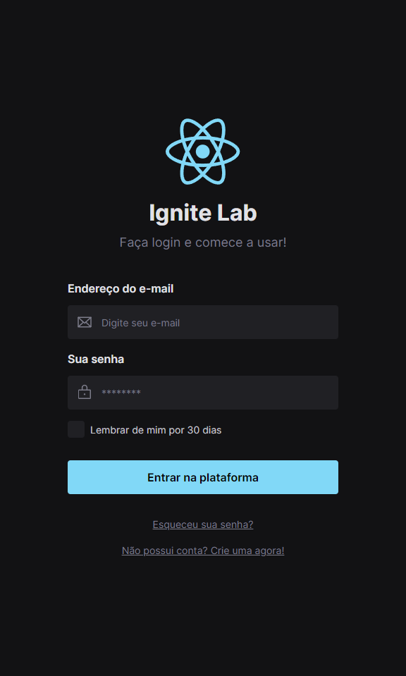
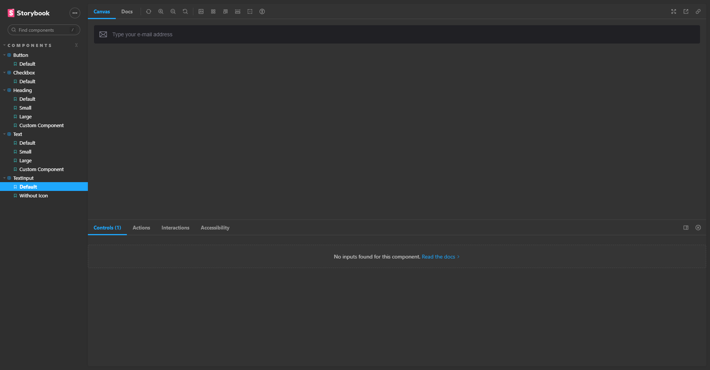
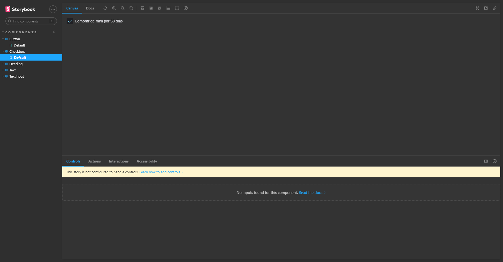
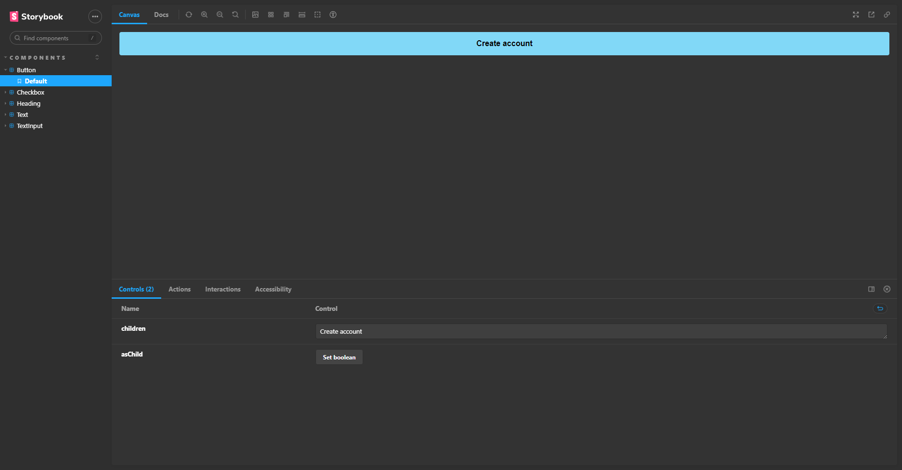

# Design System

>Projeto 'Design System' do Ignite Lab by Rocketseat

Projeto <I><b>'Design System'</b></I> do <U>Ignite Lab</U> da Rocketseat.
Um projeto ensinando do Figma ao Código, abrodando componentizações e utilizando o Storybook.

<!-- [🔗 Clique aqui para acessar](https://luanpablocs.github.io/meus-links/) -->

## 🌐 Tecnologias

 
 
 
 
 

## 📱 Contato

